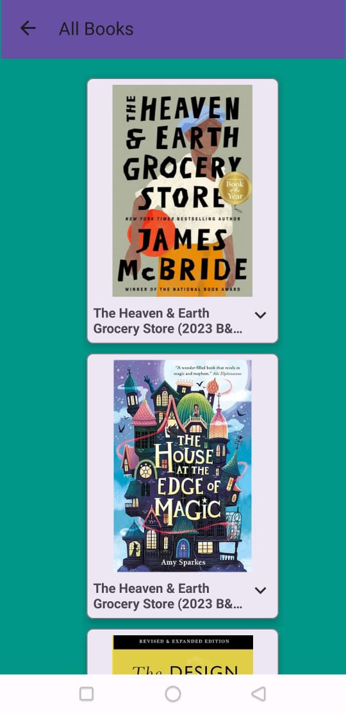

# mylibrary
MyLibrary is a tutorial covering RecyclerView, SharedPreferences, and callback functions. Explore RecyclerView for dynamic data display, integrate SharedPreferences for persistent storage, and gain insights into callback functions for seamless interaction in your application.

## Demo App ( Images)

### Home Page

### All Book Listing Page

### Detail Page

